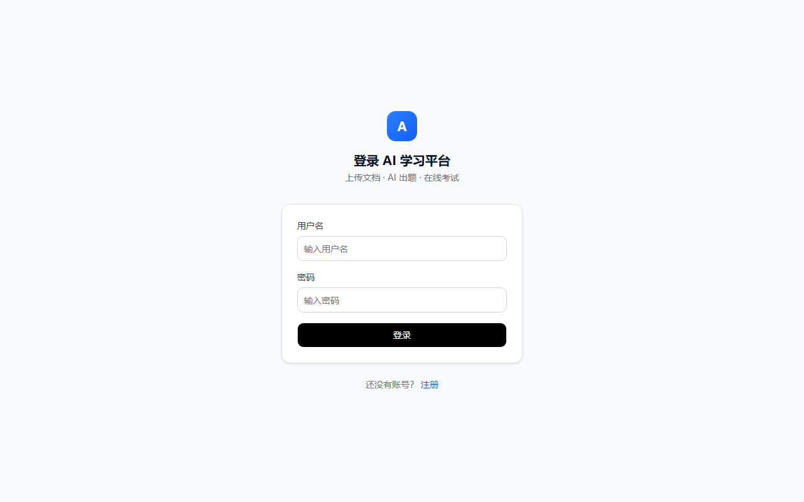
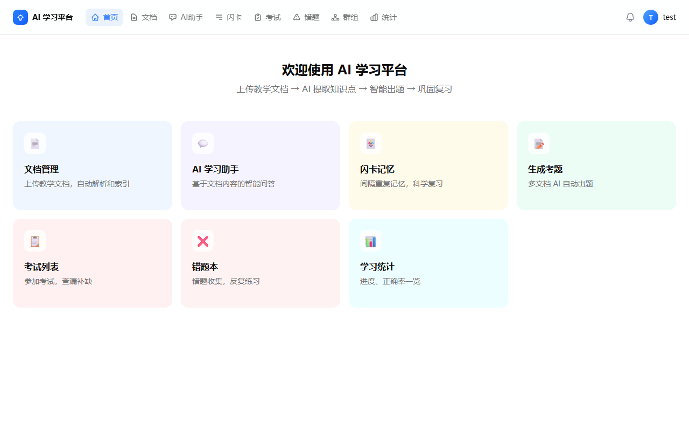
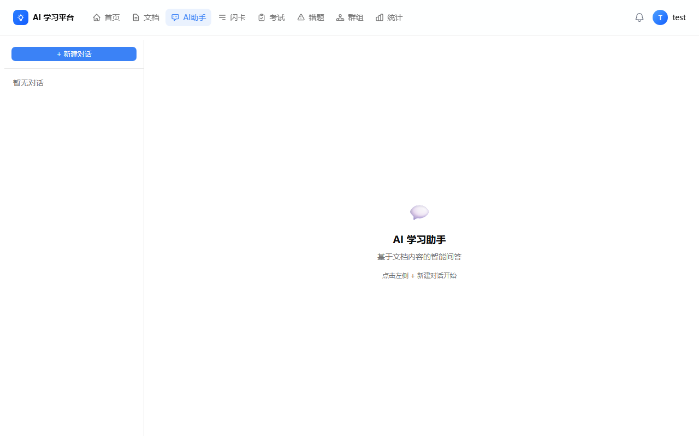
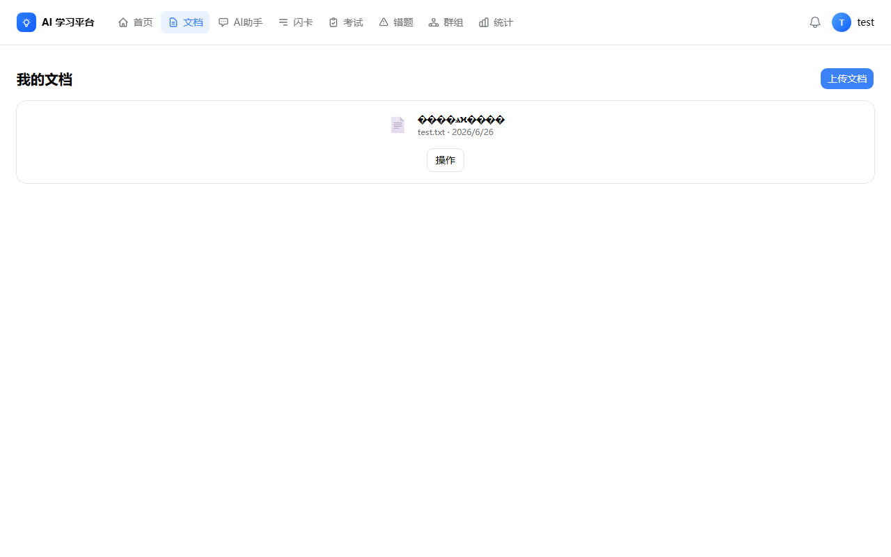
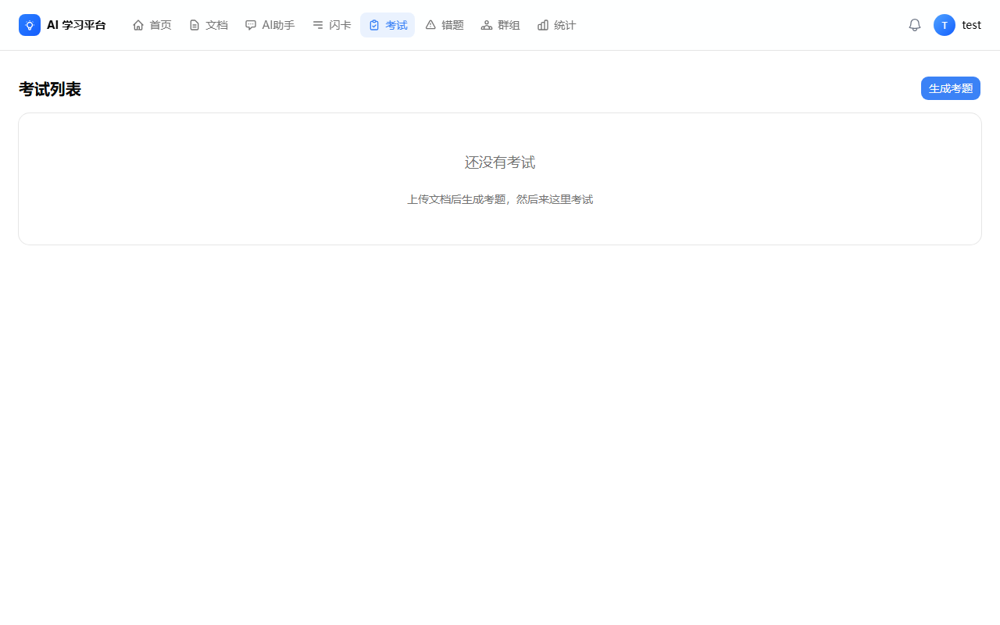
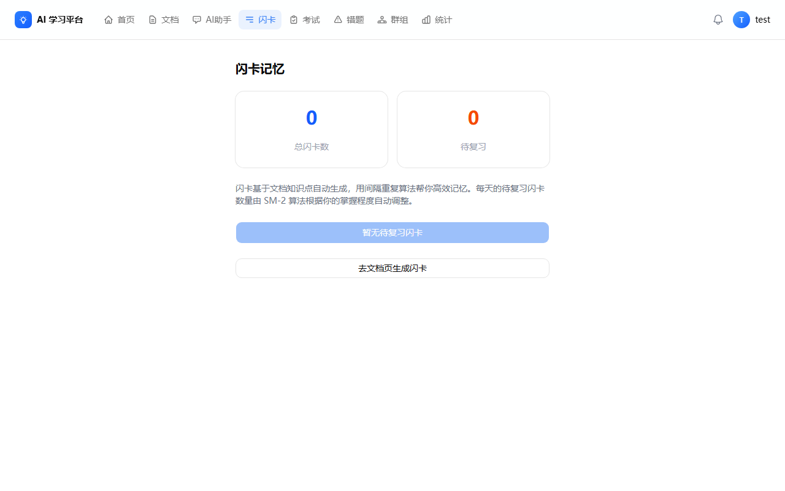
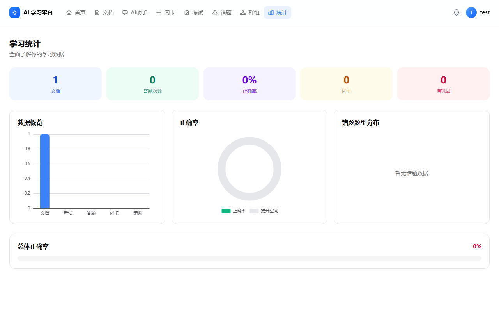

# AI 学习平台

基于 Spring Boot 3 + Next.js 16 + AI 大模型构建的智能学习平台。支持文档自动解析、AI 智能问答、自动出题、在线考试、闪卡复习等核心功能。

## 技术栈

| 层级 | 技术选型 |
|------|----------|
| **前端** | Next.js 16, React 19, TypeScript, Shadcn UI, Tailwind CSS |
| **后端** | Spring Boot 3.2, Java 17, Spring Security, MyBatis |
| **数据库** | PostgreSQL + pgvector, Redis |
| **AI** | DeepSeek / 智谱 API, RAG 检索增强生成 |
| **文档解析** | Apache PDFBox, Apache POI (Word/Excel/PPT) |
| **构建** | Maven, npm, Docker |

## 核心功能

### AI 智能对话
基于 DeepSeek 大模型，支持对上传的文档进行智能问答。系统通过 RAG（检索增强生成）技术，先检索文档中的相关内容，再由 AI 生成回答。

### 文档管理
支持 PDF、Word、PPT 等格式文档上传与解析，自动提取文本内容，构建知识库。

### RAG 检索增强
文档上传后自动切片、向量化（基于 pgvector），支持语义级别的内容检索，为 AI 问答提供精准的知识支撑。

### 自动出题
基于文档内容，由 AI 自动生成各类考题（选择题、填空题、简答题等），支持手动指定题目类型和数量。

### 在线考试
完整的考试流程：生成试卷、在线作答、自动评分、成绩分析。支持考试记录和答题情况回溯。

### 错题本
自动收录错题，支持分类查看、重复练习、掌握状态追踪。

### 闪卡复习
基于间隔重复算法的闪卡系统，帮助用户利用遗忘曲线进行高效复习。

### 学习统计
学习时长、考试次数、平均分数等数据可视化展示，支持按时间维度分析学习趋势。

### 知识点提取
上传文档后自动提取关键知识点，形成结构化知识网络。

### 分组学习
支持创建学习小组，成员间共享文档和笔记。

### 管理员系统
用户管理、文档审核、系统监控等后台管理功能。

### 监督模式
家长/教师监督模式，可查看学生学习进度和统计数据。

## 系统架构

```
┌─────────────────────────────────────────────────────┐
│                   用户浏览器                           │
│              Next.js 16 + React 19                    │
└──────────────────┬──────────────────────────────────┘
                   │ HTTP / REST
                   ▼
┌─────────────────────────────────────────────────────┐
│           Nginx 反向代理                              │
└──────────────────┬──────────────────────────────────┘
                   │
          ┌────────┴────────┐
          ▼                  ▼
┌─────────────────┐  ┌─────────────────┐
│  Spring Boot 3   │  │  Next.js SSR    │
│  Java 17         │  │  TypeScript     │
│  REST API :8080  │  │  :3000          │
├────────┬────────┤  └────────┬────────┘
│ Service│Controller│         │
│  层    │   层    │          │
├────────┴────────┤          │
│ MyBatis Mapper   │          │
└────────┬────────┘          │
         │                   │
    ┌────┴────┐              │
    ▼         ▼              │
┌───────┐ ┌───────┐          │
│PostgreSQL│ │ Redis │         │
│pgvector │ │ 缓存  │         │
└────────┘ └───────┘          │
         │                   │
    ┌────┴────┐              │
    ▼         ▼              │
┌────────┐ ┌────────┐        │
│DeepSeek│ │ 智谱   │        │
│  AI    │ │Embedding│       │
└────────┘ └────────┘        │
                              │
         ┌────────────────────┘
         ▼
┌─────────────────────────────────────────────────────┐
│                   Docker 部署                         │
└─────────────────────────────────────────────────────┘
```

## 项目结构

```
ai-learning-platform/
├── backend/                      # 后端：Spring Boot 3 + Java 17
│   ├── src/main/java/com/exam/
│   │   ├── config/               # 配置（Security、JWT、CORS、Redis）
│   │   ├── controller/           # 16 个 REST 控制器
│   │   ├── dto/                  # 数据传输对象
│   │   ├── mapper/               # 14 个 MyBatis 映射接口
│   │   ├── model/                # 12 个数据模型
│   │   ├── service/              # 12 个业务服务
│   │   └── util/                 # 工具类（JWT 等）
│   ├── sql/                      # 数据库初始化脚本
│   ├── pom.xml
│   └── DEPLOY.md
│
├── frontend/                     # 前端：Next.js 16 + React 19
│   ├── src/
│   │   ├── app/                  # 路由页面
│   │   ├── components/           # UI 组件
│   │   ├── lib/                  # 工具库
│   │   └── types/                # TypeScript 类型
│   ├── prisma/                   # Prisma ORM 定义
│   ├── package.json
│   └── next.config.ts
│
├── docs/                         # 文档
├── README.md
├── DEPLOY.md                     # 部署指南（Docker）
└── DEPLOY_ONLINE.md              # 免费云部署指南（Railway）
```

## 快速开始

### 前置条件

- Java 17+
- Node.js 20+
- PostgreSQL (含 pgvector 扩展)
- Redis

### 数据库初始化

```bash
psql -U postgres -c "CREATE DATABASE doc_exam_platform;"
psql -U postgres -d doc_exam_platform -f backend/sql/init.sql
```

### 启动后端

```bash
cd backend
mvn spring-boot:run
```

服务启动在 `http://localhost:8080`

### 启动前端

```bash
cd frontend
npm install
npm run dev
```

访问 `http://localhost:3000`

### 免费云部署

参照 `DEPLOY_ONLINE.md`，使用 Railway 免费部署上线（无需信用卡）。

### Docker 部署

参照 `DEPLOY.md`，支持 Docker Compose 一键部署。

## 环境变量

### 后端

| 变量 | 说明 |
|------|------|
| `spring.datasource.url` | PostgreSQL 连接地址 |
| `spring.data.redis.host` | Redis 连接地址 |
| `app.deepseek.api-key` | DeepSeek API 密钥 |
| `app.deepseek.base-url` | DeepSeek API 地址 |
| `app.zhipu.api-key` | 智谱 API 密钥 |
| `app.zhipu.embedding-model` | Embedding 模型名 |

### 前端

| 变量 | 说明 |
|------|------|
| `NEXT_PUBLIC_API_URL` | 后端 API 地址 |

## 截图

| 登录页 | 仪表盘 | AI 对话 |
|:------:|:------:|:-------:|
|  |  |  |

| 文档管理 | 考试 | 闪卡 | 学习统计 |
|:--------:|:----:|:----:|:--------:|
|  |  |  |  |

## 路线图

- [x] 用户认证与权限管理
- [x] 文档上传与解析
- [x] AI 智能对话
- [x] 自动出题
- [x] 在线考试
- [ ] 移动端适配
- [ ] 更多 AI 模型接入
- [ ] 国际化支持

## License

MIT
